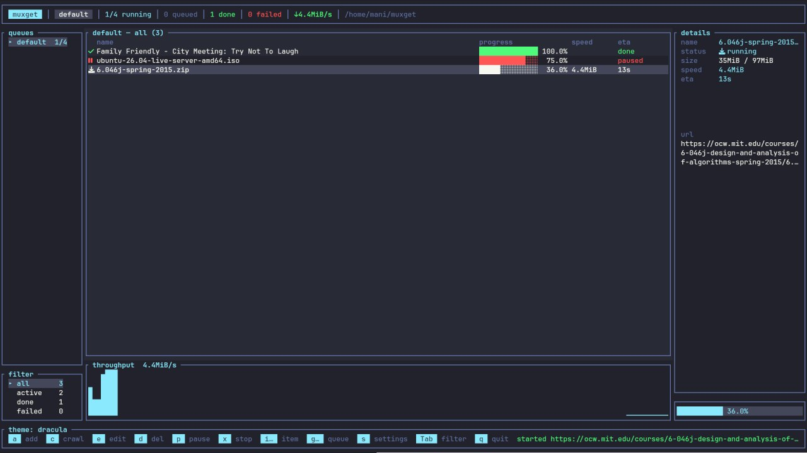

# muxget

A terminal download manager that drives `aria2c`, `yt-dlp` and `wget` for you.

Paste a url — muxget picks the right backend, queues it, and shows live
progress. Direct files, torrents and magnets go to aria2c; everything else goes
to yt-dlp, and playlists expand into one row per video. Point it at a page
instead and it crawls for links, or mirrors the whole site for offline use.

Queues have their own slots, schedules, bandwidth quotas and retry limits, and
the whole list — pauses included — comes back where you left it.




Full documentation: **[the manual](docs/manual.md)** — every key, every field,
every config file, and how it all works underneath.

## Requirements

`aria2c` and `yt-dlp` on your `PATH`, plus `wget` for crawling, and a Rust
toolchain to build.

## Install

```sh
cargo install --path .
```

## Usage

```sh
muxget                                  # empty, add urls with `a`
muxget https://example.com/linux.iso    # start with urls queued
muxget -d ~/Downloads -j 5 <url>...     # directory and concurrent slots
muxget --theme nord                     # theme for this run
```

| flag | means |
|---|---|
| `-d <dir>` | download directory for this run; otherwise the saved one, otherwise `$PWD` |
| `-j <n>` | slots for the default queue this run, 1-16 |
| `--theme <name>` | theme for this run; `MUXGET_THEME` does the same |
| `<url>...` | queued on startup, routed by the same rules as `a` |

Nothing on the command line is persisted — `-d`, `-j` and `--theme` override
the saved values for that run only.

## Keys

| key | action |
|---|---|
| `a` | add a url |
| `c` | crawl a page for links |
| `e` | edit the selected url (restarts it) |
| `d` | delete the selected download |
| `p` or `Space` | pause / resume the selected download |
| `P` | pause / resume every queue |
| `x` | stop it, keep the row |
| `j` / `k` | move the selection |
| `J` / `K` | move the download within its queue |
| `s` | settings |
| `Tab` | cycle filter: all / active / done / failed |
| `[` `]` | switch queue |
| `q` or `ZZ` | quit |

The mouse works too: click a queue, a filter or a row to select it, and scroll
over the queue list or the table to move through them. A dialog or the settings
panel owns the keyboard while it is open, and the mouse with it.

Queue and item commands are two-key sequences; press the prefix and a menu
shows the rest. Settings are one panel, opened with `s`.

## Adding a download

`a` opens a form. Only the url is required; everything else overrides what
would otherwise be decided for you, for that download alone.

| field | means |
|---|---|
| url | what to fetch; a page yt-dlp knows is expanded into one row per video |
| range | `1-10` with `%d` or `%03d` in the url adds the whole numbered series, up to 500 rows |
| directory | where this one lands, instead of the download directory |
| file name | what to call it; with a range, `%d` is filled in per item |
| rate limit | e.g. `2M`, for this download only |
| user / password | sent through a private file, never on the command line |

The backend is picked from the url: direct files, torrents and magnets go to
aria2c, anything else to yt-dlp, and `wget` handles crawls. A routing rule can
name one instead.

**Passwords are never written to disk.** They live in a `0600` file for as long
as the download runs, are deleted when it ends, and the state file has no field
for them — a download restored from an earlier run needs its password typed
again.

## Crawling a page

`c` opens a form: the page, how many links deep to follow, and what to keep.

| field | means |
|---|---|
| depth | how many links deep to follow, `1` by default |
| extensions | `pdf,zip,mp3` — every type when empty |
| include / exclude | url patterns, comma separated; `*` is a wildcard, anything else matches as a substring, and excludes win |
| size min-max | `1M-500M`; a file the server gives no size for is kept |
| options | `any-domain` to follow links off the host, `under-path` to stay under the start url, `no-robots` to ignore the site's crawling rules, `flat` to skip the directory structure, `offline` to mirror instead of listing |

Without `offline` the crawl walks the site without downloading anything and
comes back with the list it found — one entry per url, sizes included. `space`
picks a link, `a` picks all of them, `Enter` queues what is picked. Each file
lands under the path its url maps to, so `https://x.com/docs/a/b.pdf` becomes
`x.com/docs/a/b.pdf` in the download directory. A query string is folded into
the file name instead of making an unopenable one, and a name already taken is
renamed rather than overwritten. `flat` drops the directories.

With `offline` the whole site is fetched as a single row: pages plus the
stylesheets, scripts, images and fonts they need, with links rewritten to
point at the local copies. Resources the server does not have are reported as
they are found, and the copy is still finished.

Re-running an `offline` crawl over the same directory downloads only what
changed — everything else is compared by timestamp and left alone, and the
count of skipped files is reported. Point a queue's `sync=` schedule at it and
the local copy keeps itself current. wget's own timestamps on disk are the
crawl state; nothing else has to be remembered.

Crawl-wide wget settings — user agent, rate limit, `robots.txt`, extra headers
— live in the backends tab of `s`, next to the aria2c and yt-dlp ones.

| sequence | action |
|---|---|
| `gn` `gr` `gd` | new / rename / delete queue |
| `gj` `gk` | next / previous queue |
| `g>` `g<` | move this queue in the tab order |
| `gp` `gP` | pause / resume this queue / every queue |
| `gt` | schedule for this queue |
| `g+` `g-` | slots for this queue |
| `ir` `iR` | remove / remove with its file |
| `io` `if` | open / open containing folder |
| `iF` | force restart (torrents) |
| `it` | retry a failed or cancelled download |

## Queues

Every download belongs to a queue, and each queue runs its own slots — a busy
lane never blocks another. New downloads land in the queue you are viewing.
Deleting a queue moves its downloads to the default one rather than dropping
them; the default queue itself cannot be deleted.

### Schedules

`gt` takes one line, in any order:

```
22:00-06:00 mon-fri on=2026-08-01 once sync=6h retry=3 quota=150MB/4h shutdown after=<command>
```

A window wraps past midnight. `mon-fri` and `sat,sun` limit it to weekdays,
`on=` to a single date. `once` runs the queue through and then drops the
schedule, `sync=` puts everything finished back in the queue that often, and
`retry=` is how many times a failure is tried again. `quota=` parks the queue
once it has moved that much in a period, until the next one starts. When the
queue drains, `after=` runs a command (it takes the rest of the line, so put
it last) and `shutdown` halts the machine. Empty clears the lot.

Quota use is the reported speed integrated over time, so it is a few percent
out; sync and quota periods count from launch, not from the wall clock.

### Pausing

Pausing sends `SIGSTOP` to the backend process: connections and the partial
file stay put, and the freed slot goes to whatever is queued behind it. `p`
again sends `SIGCONT`. Over a long pause a server may drop the socket anyway —
both backends retry and resume from where the file left off.

`gp` pauses the whole queue and `P` pauses every queue: running downloads
freeze and, unlike a single pause, nothing queued behind them starts. `P` on a
half-paused app resumes everything, so one key always reaches a known state.

## Routing rules

New downloads land in the queue you are viewing — unless a rule says otherwise.
`~/.config/muxget/rules` matches on file extension, domain or size and picks
the queue, the directory, or the backend for you. Queues named by a rule are
created on first use.

```toml
# ~/.config/muxget/rules
[[rule]]
extensions = ["iso", "img"]
queue = "large-files"
directory = "~/Downloads/ISOs"

[[rule]]
domains = ["youtube.com", "youtu.be"]
queue = "media"

[[rule]]
min_size = "5G"
queue = "overnight"
```

The first matching rule wins, and every condition it sets has to match — a rule
with both `extensions` and `domains` means "this kind of file, from there".
Anything typed into the add form beats a rule.

`min_size` cannot be answered before the download starts, so those rules are
applied once the backend reports a total and the download moves queue then.

## Settings

`s` opens the settings panel. `Tab` moves between its tabs, `j`/`k` move
within one, `Esc` closes.

- **general** — theme, download directory, nerd font icons, confirm before dl playlist.
  With confirmation on, a playlist opens a picker: `/` filters by words in the title, `t` by upload date range, `space` picks, `Enter` queues.
- **backends** — a form over the common aria2c, yt-dlp and wget options:
  `Enter` toggles a switch or edits a value, `b` switches backend, `x` unsets
  one.
- **categories** — the routing rules as they will be applied.

Everything is stored as plain flags in `~/.config/muxget/aria2c.args`,
`yt-dlp.args` and `wget.args`, passed to the tool verbatim and appended last, so they override
muxget's own defaults. Flags the panel has no entry for are kept untouched, so
hand-editing those files works alongside the UI:

```sh
# ~/.config/muxget/aria2c.args
--split=16 --max-connection-per-server=16
--max-download-limit=2M
```

## What persists

Your download list, your queues — names, slots, schedules and pauses — the
download directory and the theme are saved to `~/.config/muxget/` as you change
them. There is no save step.

Next launch picks the list back up where it left off: finished, failed and
cancelled rows return as history, paused rows and paused queues come back
paused, and anything that was running or waiting comes back queued and
**resumes from its partial file** as slots free up. Retries already spent
against a queue's `retry=` carry over too, so a hopeless download does not get
a fresh set of attempts every launch. Resuming a row paused in an earlier run
puts it back in the queue — the process it was stopped with is long gone.

```
# ~/.config/muxget/state
dir = /home/you/Downloads
queue = default|3||0|
queue = media|7|22:00-06:00 mon-fri retry=3|1|paused
download = 0|done|100|https://example.com/linux.iso
download = 1|queued|12.5|https://youtube.com/watch?v=abc
over = /tmp/here||2M||wget|--recursive --level=2
tries = 1
```

`queue` is `name|slots|schedule|id|paused`, `download` is
`queue|status|percent|url`, and the optional `over`, `pid` and `tries` lines
attach to the download above them. The url is the last unsplit field, so one
containing a `|` survives. A line that does not parse is skipped rather than
losing the file.

## Themes

Six built in — tokyonight (default), catppuccin, monokai, gruvbox, nord,
dracula. The general tab of `s` cycles them and remembers your choice.

Add your own as `~/.config/muxget/themes/<name>.toml`; a file that reuses a
built-in name overrides it. Missing keys keep the default colour:

```toml
accent   = "#7aa2f7"
ok       = "#9ece6a"
err      = "#f7768e"
muted    = "#565f89"
selected = "#292e42"
bg       = "#1a1b26"
panel    = "#16161e"
fg       = "#c0caf5"
```

## Adding a backend

Implement `Backend` in `src/models/` — a name, which urls it accepts, the
command to run, and a progress-line parser — then add it to `backends()` in
`src/models/mod.rs`. Spawning, output reading and progress reporting are shared.

Four optional hooks: `reason` turns an exit code into something a person can
read, `tolerates` marks an exit code that is not really a failure, `notice`
turns a line into a status message, and `config_flag`/`credentials` say how the
tool reads a login from a file. Add an `OptSpec` list in `src/models/option.rs`
and the settings panel gets a form for it.

## Layout

```
src/
  models/       downloads, queues, crawls, backends, option specs, state file
  views/        table, sidebars, dialogs, options panel, themes
  controllers/  state, event loop, keys, queue, crawl and settings actions
  utils/        progress parsing, argument files, credential files
  main.rs
tests/          mirrors src/
```

## Documentation

[docs/manual.md](docs/manual.md) is the complete guide: the screen, the add
form, queues and schedules, crawling, routing rules, the settings panel, the
files on disk, what happens under the hood, and troubleshooting.

## License

MIT — see [LICENSE](LICENSE).
